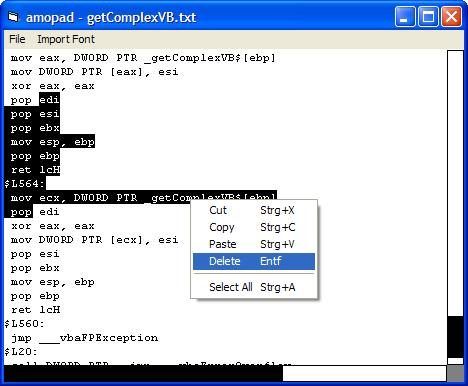

<div align="center">

## Still Another Textbox


</div>

### Description

This is a textbox. It does not use regular typefaces but bitmaps.
 
### More Info
 


<span>             |<span>
---                |---
**Submitted On**   |2005-12-05 06:10:04
**By**             |[amoxys](https://github.com/Planet-Source-Code/PSCIndex/blob/master/ByAuthor/amoxys.md)
**Level**          |Beginner
**User Rating**    |4.8 (24 globes from 5 users)
**Compatibility**  |VB 6\.0
**Category**       |[Custom Controls/ Forms/  Menus](https://github.com/Planet-Source-Code/PSCIndex/blob/master/ByCategory/custom-controls-forms-menus__1-4.md)
**World**          |[Visual Basic](https://github.com/Planet-Source-Code/PSCIndex/blob/master/ByWorld/visual-basic.md)
**Archive File**   |[Still\_Anot1953961252005\.zip](https://github.com/Planet-Source-Code/amoxys-still-another-textbox__1-63515/archive/master.zip)

### API Declarations

```
Function BitBlt Lib "gdi32" (ByVal hDestDC As Long, ByVal X As Long, ByVal Y As Long, ByVal nWidth As Long, ByVal nHeight As Long, ByVal hSrcDC As Long, ByVal xSrc As Long, ByVal ySrc As Long, ByVal dwRop As Long) As Long
Function CreateCaret Lib "user32" (ByVal hwnd As Long, ByVal hBitmap As Long, ByVal nWidth As Long, ByVal nHeight As Long) As Long
Function ShowCaret Lib "user32" (ByVal hwnd As Long) As Long
Function SetCaretPos Lib "user32" (ByVal X As Long, ByVal Y As Long) As Long
Function DestroyCaret Lib "user32" () As Long
```


